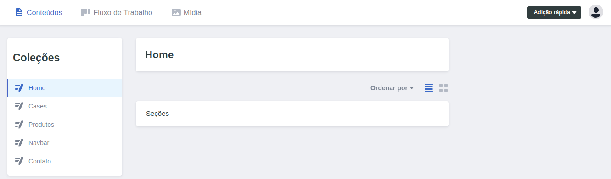
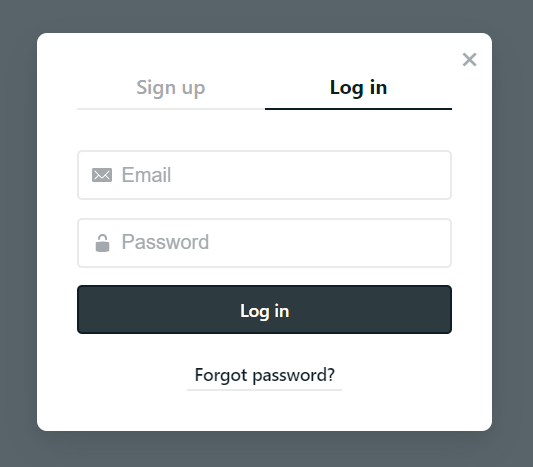
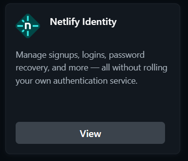
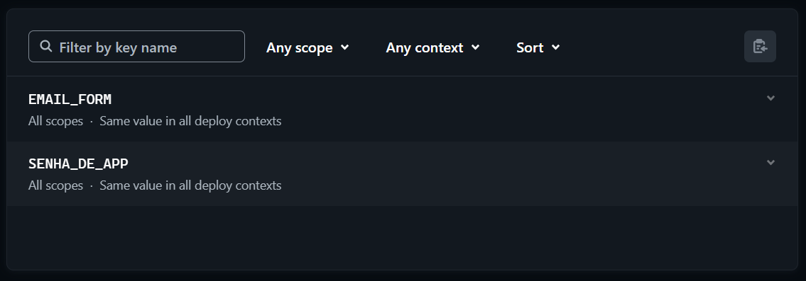
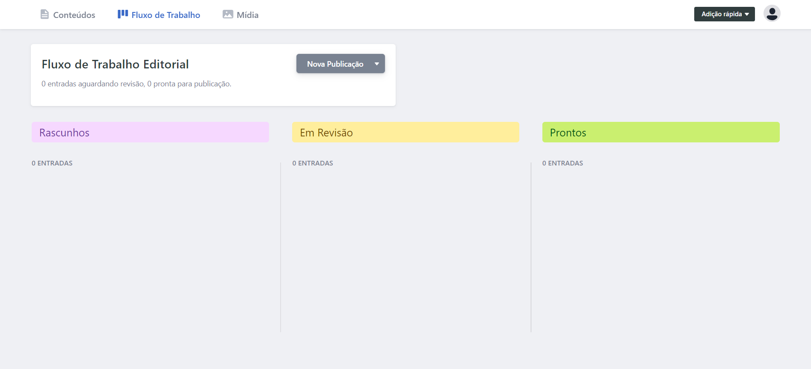
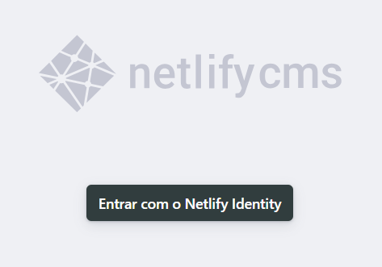
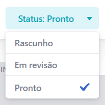
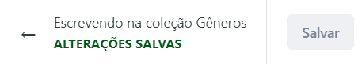
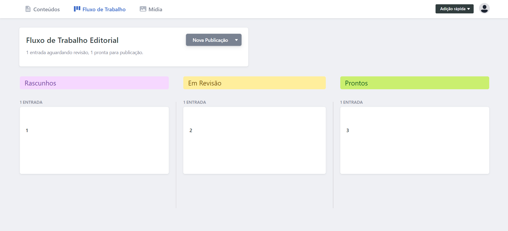

**Instruções de Uso do [Netlify](https://www.netlify.com/)**

1. **E-mails autorizados**

	Para editar os e-mails autorizados a modificar o conteúdo do site,  siga os passos abaixo:

1. Acesse a seção *Team IDE Jr*.  
2. Selecione o site *idejr.com.br*.  
3. Navegue até *Integrations*.  
4. Selecione *Identity*.  registro.br
5. Clique em *View*.

2. **Conteúdo do Site**

	Para modificar o conteúdo do site, siga os passos abaixo:

1. Acesse a URL: [idejr.com.br/admin](http://idejr.com.br/admin).  
2. Faça login ou crie uma conta com um e-mail autorizado.

3. Navegue até *Conteúdos* \-\> *Coleções* \-\> Pasta \-\> Arquivo.

4. Faça as alterações desejadas e clique em *Salvar*.

****

5. Retorne para acessar o Fluxo de Trabalho Editorial (opcional).

****

6. Para editar o status, navegue até *Status* e clique em *Pronto*.

****

7. Para publicar, navegue até *Publicar* e clique em *Publicar agora*.

****

3. **Fluxo de Trabalho Editorial**

	Interface gráfica para auxiliar na visualização das modificações que serão feitas no site. Para utilizá-la:

1. Acesse *Fluxo de Trabalho*.

2. As modificações **salvas** aparecerão em *Rascunhos*, a partir desse momento elas podem ser **arrastadas** para a etapa do fluxo na qual se encontram.

****

3. Para publicar, acesse *Prontos* e selecione *Publicar nova entrada*.

****

4. **Credenciais dos Formulários**

	Para editar o e-mail e [senha de app](https://support.google.com/accounts/answer/185833?sjid=11550070485906794192-SA) da conta Google que receberá os e-mails com os dados dos formulários, siga os passos abaixo:

1. Acesse a seção *Team IDE Jr*.  
2. Acesse o site *idejr.com.br*.  
3. Navegue até *Site configuration*.  
4. Selecione *Environment variables*.

5. Faça um novo deploy do site para que as alterações sejam aplicadas.  
   1. Acesse a seção *Team IDE Jr*.  
   2. Acesse o site *idejr.com.br*.  
   3. Navegue até *Deploys*.  
   4. Selecione *Trigger deploy*.  
   5. Clique em *Deploy site*.

****

5. **Limitações**

	O plano grátis do Netlify possui limitações quanto à quantidade de modificações que podem ser feitas por mês. Em circunstâncias normais, esse limite é difícil de ser atingido. No entanto, se o site não receber as modificações feitas na interface de administração, isso pode indicar que o limite mensal foi atingido.

6. **Formulários**

   O envio dos formulários não está relacionado ao Netlify. No entanto, é importante destacar que o Gmail atualmente impõe um [limite](https://support.google.com/mail/answer/22839#zippy=%2Cvoc%C3%AA-alcan%C3%A7ou-o-limite-de-envio-de-e-mails) de 500 e-mails enviados por dia.

6. **Domínio**
Para gerenciar o domínio e os registros DNS, acesse o site [registro.br](https://registro.br).