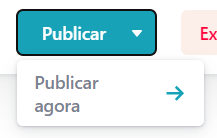
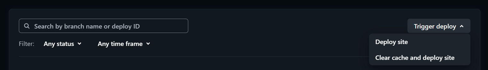

**Instruções de Uso do [Netlify](https://www.netlify.com/)**

1. **E-mails autorizados**

   Para editar os e-mails autorizados a modificar o conteúdo do site, siga os passos abaixo:

1. Acesse a seção _Team IDE Jr_.
1. Selecione o site _idejr.com.br_.
1. Navegue até _Integrations_.
1. Selecione _Identity_. registro.br
1. Clique em _View_.

1. **Conteúdo do Site**

   Para modificar o conteúdo do site, siga os passos abaixo:

1. Acesse a URL: [idejr.com.br/admin](http://idejr.com.br/admin).
1. Faça login ou crie uma conta com um e-mail autorizado.

3. Navegue até _Conteúdos_ \-\> _Coleções_ \-\> Pasta \-\> Arquivo.

4. Faça as alterações desejadas e clique em _Salvar_.

****

5. Retorne para acessar o Fluxo de Trabalho Editorial (opcional).

****

6. Para editar o status, navegue até _Status_ e clique em _Pronto_.

****

7. Para publicar, navegue até _Publicar_ e clique em _Publicar agora_.

****

3. **Fluxo de Trabalho Editorial**

   Interface gráfica para auxiliar na visualização das modificações que serão feitas no site. Para utilizá-la:

1. Acesse _Fluxo de Trabalho_.

2. As modificações **salvas** aparecerão em _Rascunhos_, a partir desse momento elas podem ser **arrastadas** para a etapa do fluxo na qual se encontram.

****

3. Para publicar, acesse _Prontos_ e selecione _Publicar nova entrada_.

****

4. **Credenciais dos Formulários**

   Para editar o e-mail e [senha de app](https://support.google.com/accounts/answer/185833?sjid=11550070485906794192-SA) da conta Google que receberá os e-mails com os dados dos formulários, siga os passos abaixo:

1. Acesse a seção _Team IDE Jr_.
1. Acesse o site _idejr.com.br_.
1. Navegue até _Site configuration_.
1. Selecione _Environment variables_.

5. Faça um novo deploy do site para que as alterações sejam aplicadas.
   1. Acesse a seção _Team IDE Jr_.
   2. Acesse o site _idejr.com.br_.
   3. Navegue até _Deploys_.
   4. Selecione _Trigger deploy_.
   5. Clique em _Deploy site_.

****

5. **Limitações**

   O plano grátis do Netlify possui limitações quanto à quantidade de modificações que podem ser feitas por mês. Em circunstâncias normais, esse limite é difícil de ser atingido. No entanto, se o site não receber as modificações feitas na interface de administração, isso pode indicar que o limite mensal foi atingido.

6. **Formulários**

   O envio dos formulários não está relacionado ao Netlify. No entanto, é importante destacar que o Gmail atualmente impõe um [limite](https://support.google.com/mail/answer/22839#zippy=%2Cvoc%C3%AA-alcan%C3%A7ou-o-limite-de-envio-de-e-mails) de 500 e-mails enviados por dia.

7. **Domínio**
   Para gerenciar o domínio e os registros DNS, acesse o site [registro.br](https://registro.br).
